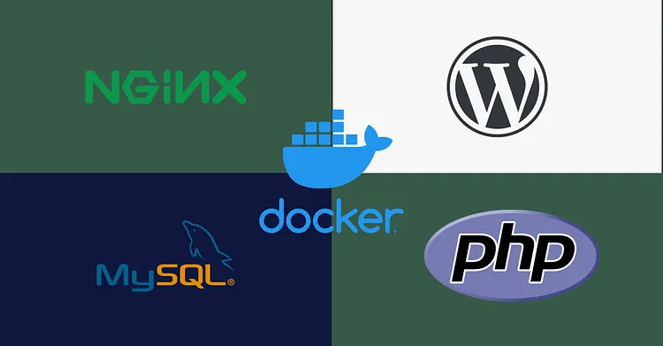
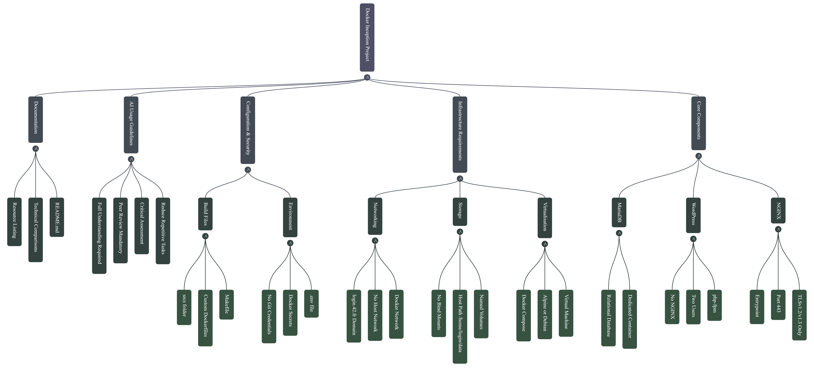

*This project has been created as part of 42 curriculum by ibondarc.*

# INCEPTON - Dockerized Web Infrastracture

---

## Quick navigation

- [Description](#Description)
- [Project Architecture]("#Project Architecture")
- [Technical Design Choices]("#Technical Design Choices")
- [Instruction](#Instruction)
- [Documentation](#Documentation)
- [Resources](#Resources)

---

##  Description

**Inception** is a system administration and DevOps project focused on building a secure,
production-style web infrasructure using Docker. The goal of this project is to conteinerize
a complete WordPress stack composed of:

- [NGINX](#Resources) - Revere proxy with TLS termination
- [PHP-FPM](#Resources) - PHP ececution engine
- [MariaDB](#Resources) - Relational database
- [WordPress](#Resources) - CMS application layer 
- [Docker Volumes](#Resources) - Persistent storage
- [Docker Bridge Network](#Resources) - Isolated internal communication

The infrastracture is orchestrated usin **Docker Compose** and follows best practices in container isolation, service networking, TLS configuration, and data persistence.

This project demonstrates how modern web services are deployed in isolated environments while maintaining secure and maintainable architecture.

---

##  Project Architecture

**Browset** => **NGINX** => **PHP-FPM (WordPress)** => **MariaDB**

Each service runs in its own container and communicate throught a private Docker network
using a specific port.

---

##  Technical Design Choices

###  Why Docker?

Docker allows applications and services to run in isolated containers that include all required
dependencies. This guarantees:

- Isolation
- Portability
- Reeproducibility
- Simplified deployment

###     Virtual Machines vs Docker

| Virtual Machines        | Docker                  |
|-------------------------|-------------------------|
| Full OS per VM          | Sharres host kernel     |
| Heavy resource usage    | Lightweight containers  | 
| Slover startup          | Fast startup            |
| Hardware virtualization | OS-level virtualization |

Docker is preferred becouse it's lightweight and faster than full OS such as Linux, in addition
better suited for microservice-based architectures.

###     Secrets vs Environment Variable

| Secrets                     | Environment Variables       |
|-----------------------------|-----------------------------|
| Securely stored             | Visible in container config |
| Not exposed in image layers | Can leak in logs            |
| Better for prodaction       | Acceptable for development  |

In this project, environment variables are used for simplicity, but secrets are recommendet for production
environments.

###     Docker Network vs Host Network

| Dcker Network               | Host Network                |
|-----------------------------|-----------------------------|
| Container isolated          | Shares host networking      |
| Internal DNS resolution     | No isolation                |
| Better security             | Less secure                 |
| Controlled communication    | Direct host access          |

A didicated Docker bridge network is used to ensure service isolation and internal DNS resolution.

###     Docker Volumes vs Bind Mounts

| Dcker Volumes               | Bind Mounts                 |
|-----------------------------|-----------------------------|
| Managed by Docker           | Linked to host filesystem   |
| Portable                    | Host-dependent              |
| Safer in production         | Good for development        |
| Abstract storage location   | Direct host access          |

Docker volumes are used to persist database and WordPress data securely and independently 
from the host system.

---

##  Instruction 

###  1.  Prerequisites

- Docker 
- Docker Compose
- GNU Make
- Linux environment (Debian or Ubuntu recommended)

- [General system requirements](https://docs.docker.com/desktop/setup/install/linux/)
- [Install Docker Engine on Debian](https://docs.docker.com/engine/install/debian/)

###  2.  Clone the repositoty

    git clone https://github.com/IgoryanDeltoro/inception.git && cd inception 

### 3.  Start project 

    make

### 4. For more detail instruction, see:

| Document setup             | Description                      | 
|----------------------------|----------------------------------|
| [USER_DOC.md](USER_DOC.md) | End-user and administrator guide |
| [DEV_DOC.md](DEV_DOC.md)   | Developer setup and architecture |

---

##  Resources

- [Docker Documentation](https://docs.docker.com/)
- [Docker compose Documantation](https://docs.docker.com/compose/)
- [NGINX Documentation](https://nginx.org/en/docs/)
- [TLS Wickipedia](https://en.wikipedia.org/wiki/Transport_Layer_Security)
- [PHP-FPM Documentation](https://www.php.net/manual/en/install.fpm.php)
- [MariaDB Documentation](https://mariadb.org/documentation/)
- [WordPress Documentation](https://mariadb.org/documentation/)
